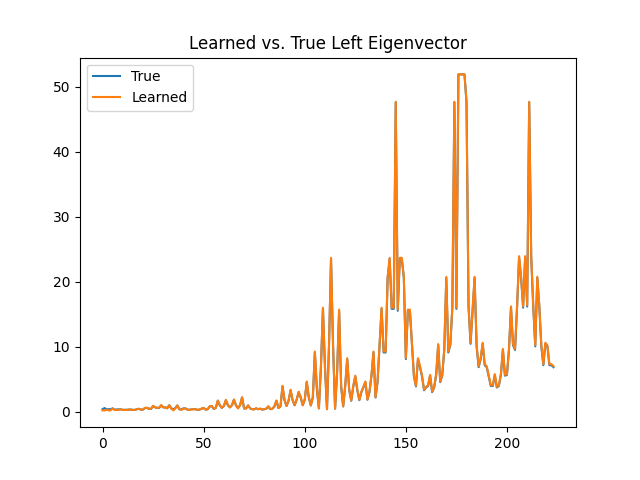
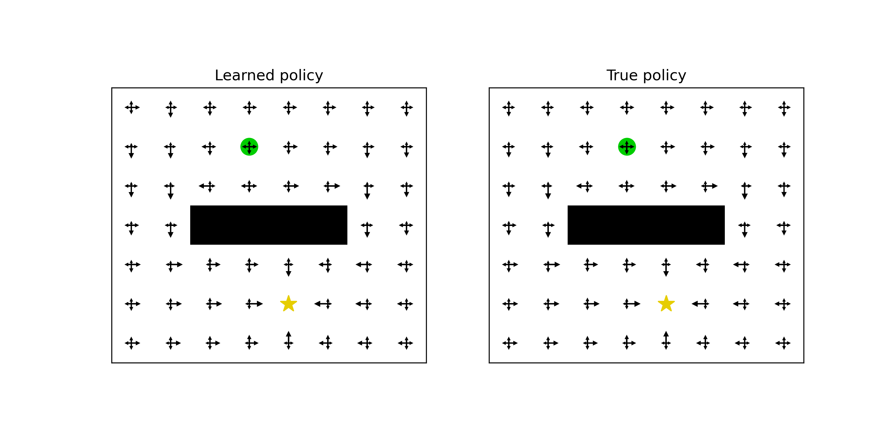

LogU learning implementation in gym (mazes and cartpole)

# New (Simple) Features:
- [ ] Monitor FPS
- [ ] Monitor min/max of logu to watch for divergence
- [ ] Add learning rate decay thru scheduler
- [x] Add "train_freq" rather than episodic trainin:
- [ ] Possibly use SB3 style: :param train_freq: Update the model every ``train_freq`` steps. Alternatively pass a tuple of frequency and unit
        like ``(5, "step")`` or ``(2, "episode")``.
- [x] Add gradient clipping
- [ ] More clever normalization to avoid logu divergence

# Experimental questions:
- [ ] Why does using continuous=True in batch sampling result in nans?
- [ ] Does stabilizing theta help stabilize logu? (i.e. fix theta to g.t. value)
- [ ] Test the use of clipping theta (min_reward, max_reward) and logu (no theoretical bounds, but -50/50 after norm. to avoid divergence)
- [ ] Which params most strongly affect logu oscillations?
- [ ] "..." affect logu divergence? 

# Features requiring experiments:
- [ ] use target or online logu for exploration (greedy or not?)
- [ ] Standard prioritized replay
- [ ] Clipping theta
- [ ] smooth out theta learning

# Future TODOs:
- [ ] Generate dependencies
- [ ] Write tests
- [ ] Make more off-policy / offline?
- [ ] V learning with cloning
- [ ] UV learning
- [ ] Rawlik scheme

Model-based ground truth comparisons with tabular algorithms:

Model-free ground truth comparisons:

![eigvec][eigvec_figure]
![policy][policy_figure]

[policy_figure]: figures/policy_MF.png
[eigvec_figure]: figures/left_eigenvector_MF.png